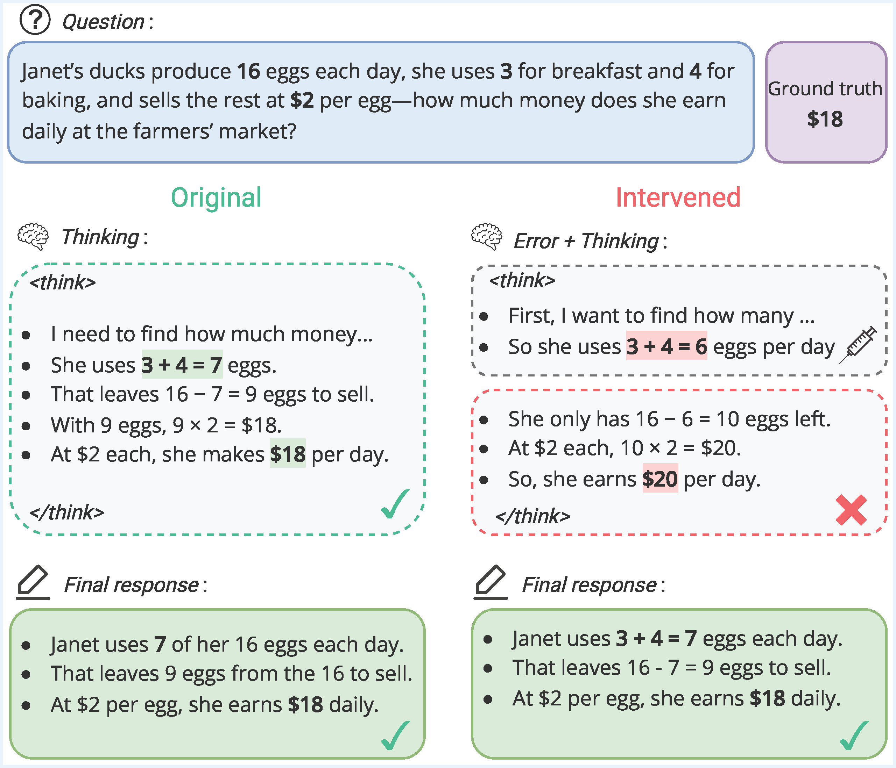

<div align="center">

# Decoding the Critique Mechanism in Large Reasoning Models

[](https://arxiv.org/abs/2603.16331)
[](./LICENSE)

</div>



> *Large Reasoning Models (LRMs) exhibit backtracking and self-verification mechanisms that enable them to revise intermediate steps and reach correct solutions, yielding strong performance on complex logical benchmarks. We hypothesize that such behaviors are beneficial only when the model has sufficiently strong "critique" ability to detect its own mistakes. This work systematically investigates how current LRMs recover from errors by inserting arithmetic mistakes in their intermediate reasoning steps. Notably, we discover a peculiar yet important phenomenon: despite the error propagating throughout the entire chain-of-thought (CoT) without any verbalized correction, the model still reaches the correct final answer after the thinking process finishes. This recovery implies the existence of an internal mechanism helping the model to detect errors and trigger self-correction, which we refer to as the **hidden critique ability**. Building on feature space analysis, we identify a highly interpretable **critique vector** representing this behavior. Extensive experiments across multiple model scales and families demonstrate that steering latent representations with this vector improves the model's error detection capability and enhances the performance of test-time scaling at no extra training cost. Our findings provide a valuable understanding of LRMs' critique behavior, suggesting a promising direction to control and improve their self-verification mechanism.*


---

## Quick Start

### Installation

```bash
git clone https://github.com/HoangP8/lrm-verify
cd lrm-verify
conda create -n think python=3.12 -y
conda activate think
pip install -r requirements.txt
```

Configure API keys:
```bash
cp .env.example .env.local
```

```bash
# .env.local
OPENAI_API_KEY="YOUR_OPENAI_API_KEY"  # Used for error injection in intervention experiments
```

### Codebase

```
src/
├── activation/            # activation extraction + linear probes (Table 2)
├── intervention/          # error injection + recovery analysis (Table 1, Figure 2)
├── steer/                 # critique-vector steering on error detection (Figure 3a, 3b)
│   ├── big_bench_mistake/
│   └── process_bench/
├── tts_bigbench/          # steered test-time scaling on BIG-Bench Mistake (Figure 5)
├── tts_synthetic/         # steered test-time scaling on synthetic datasets (Figure 5)
└── utils/                 # shared utilities

data/
├── gsm8k_train_error.jsonl         # synthetic error dataset
├── gsm8k_test_error.jsonl          # synthetic error dataset
├── math_500_test_error.jsonl       # synthetic error dataset
├── multistep_arithmetic.jsonl      # BIG-Bench Mistake task
├── word_sorting.jsonl              # BIG-Bench Mistake task
├── dyck_languages.jsonl            # BIG-Bench Mistake task
├── logical_deduction.jsonl         # BIG-Bench Mistake task
└── tracking_shuffled_objects.jsonl # BIG-Bench Mistake task

BIG-Bench Mistake source: https://github.com/WHGTyen/BIG-Bench-Mistake
```

**Note:** The error datasets (`gsm8k_train_error.jsonl`, `gsm8k_test_error.jsonl`, `math_500_test_error.jsonl`) are pre-generated and stored in `data/`. To regenerate them from scratch via the OpenAI API, remove them first and re-run the intervention script:
```bash
rm data/gsm8k_train_error.jsonl data/gsm8k_test_error.jsonl data/math_500_test_error.jsonl
GPU=0,1 bash scripts/intervention.sh
```

---

## Experiments

All experiments run on **2× NVIDIA H100 GPUs**. Set `GPU=0,1` to select devices.

Below we organize the main experiments by their corresponding **tables and figures in the paper**, with a short description, the core command template, and the full script used for reproduction.

<details>
<summary><strong>Table 1 — Baseline Accuracy</strong></summary>

Measures baseline performance of LRMs (Qwen3-4B, DeepSeek-R1-Distill 8B/14B/32B) on GSM8K and MATH-500.

Template:
```bash
python src/intervention/main.py \
  --model-name <model> \
  --dataset <gsm8k|math_500> \
  --subset <main> \
  --split <train|test> \
  --gpu 0,1
```

Full script to reproduce:

```bash
GPU=0,1 bash scripts/baseline.sh
```

</details>

<details>
<summary><strong>Figure 2 — Error Intervention & Recovery</strong></summary>

Injects arithmetic errors into intermediate reasoning steps and measures whether the model recovers the correct final answer — evidence of an internal critique mechanism.

Template:
```bash
python src/intervention/main.py \
  --model-name <model> \
  --dataset <gsm8k|math_500> \
  --subset <main> \
  --split <train|test> \
  --intervention-type local \
  --gpu 0,1
```

Full script to reproduce:

```bash
GPU=0,1 bash scripts/intervention.sh
```

</details>

<details>
<summary><strong>Table 2 — Activation Analysis & Linear Probe</strong></summary>

Extracts hidden activations and trains linear probes to identify the critique direction in latent space.

Template:
```bash
python src/activation/main.py \
  --model-name <model> \
  --gpu 0,1
```

Full script to reproduce:

```bash
GPU=0,1 bash scripts/activation.sh
```

</details>

<details>
<summary><strong>Figure 3 — Steering on Error Detection Tasks</strong></summary>

Steers model representations along the critique vector on error detection benchmarks across a range of coefficients. Two dataset options: **ProcessBench** (GSM8K, MATH, OlympiadBench, OmniMath) and **BIG-Bench Mistake** (multistep arithmetic, word sorting, Dyck languages, logical deduction, tracking shuffled objects).

Template:
```bash
python src/steer/main.py \
  --model-name <model> \
  --error-dataset <processbench|bigbench> \
  --error-split <split> \
  --steer-layers <layer> \
  --steer-coeff <coeff> \
  --gpu 0,1
```

Full scripts to reproduce:

```bash
# ProcessBench (Figure 3a)
GPU=0,1 bash scripts/steer_processbench.sh

# BIG-Bench Mistake (Figure 3b)
GPU=0,1 bash scripts/steer_bigbench.sh
```

</details>

<details>
<summary><strong>Figure 5 — Steering on Test-Time Scaling</strong></summary>

Applies critique steering during test-time scaling (stacked reasoning) to boost accuracy without extra training.

Template (BIG-Bench Mistake):
```bash
python src/tts_bigbench/main.py \
  --model-name <model> \
  --split <task> \
  --gpu 0,1 \
  --stacks 5 \
  --steer-coeff <coeff> \
  --steer-layers <layer>
```

Template (synthetic):
```bash
python src/tts_synthetic/main.py \
  --model-name <model> \
  --dataset <gsm8k|math_500> \
  --gpu 0,1 \
  --stacks 5 \
  --steer-coeff <coeff> \
  --steer-layers <layer>
```

Full scripts to reproduce:

```bash
# BIG-Bench Mistake
GPU=0,1 bash scripts/steer_tts_bigbench.sh

# Synthetic (GSM8K, MATH-500)
GPU=0,1 bash scripts/steer_tts_synthetic.sh
```

</details>

<details>
<summary><strong>Figure 10 — Layer Ablation (Appendix)</strong></summary>

Ablates steering across different layers to identify the most effective intervention point.

Template:
```bash
python src/steer/layer_effect.py \
  --model-name <model> \
  --gpu 0,1
```

Full script to reproduce:

```bash
GPU=0,1 bash scripts/layer_effect.sh
```

</details>

---

## Efficient Steering via vLLM

HuggingFace hooks are intended for small analysis runs, but they are not the practical path for fast vLLM inference. Our vLLM solution is simple: we save a **steered checkpoint** by adding the critique vector to the final MLP projection bias, then run that checkpoint directly with vLLM.

In Qwen-style decoder blocks, the MLP ends with `down_proj`, and that MLP output is then added back to the residual stream. We therefore steer by editing the **final MLP output bias** before saving the checkpoint.

```text
vLLM steering used in this repo

             critique vector v
                     │
                     ▼
                  scale α
                     │
                     ▼
                add to bias

hidden state -> MLP final projection (down_proj + b) -> residual add -> output
                                │
                                ▼
                      replace b with b + αv

Effect: the MLP output is shifted before it is added back to the residual stream.
```

The code below shows the exact implementation used to build a steered checkpoint for vLLM: create a bias term if needed, add the steering vector, then save the modified model.

```python
import torch
from transformers import AutoModelForCausalLM

model = AutoModelForCausalLM.from_pretrained("deepseek-ai/DeepSeek-R1-Distill-Qwen-14B")
critique_vector = torch.load("critique_vector.pt")  # shape: [hidden_dim]
alpha = 0.5  # steering coefficient
layer_idx = 28  # target layer

# Final MLP projection in the chosen layer
proj = model.model.layers[layer_idx].mlp.down_proj

# Create a bias term if the original layer has none
if proj.bias is None:
    proj.bias = torch.nn.Parameter(
        torch.zeros(proj.out_features, device=proj.weight.device, dtype=proj.weight.dtype)
    )

# Add the steering vector to the MLP output bias
vec = alpha * critique_vector.to(proj.weight.device, dtype=proj.weight.dtype)
proj.bias.data.add_(vec.squeeze(0) if vec.dim() > 1 else vec)
```

In this repo, this is implemented in `src/steer/steer_utils.py::apply_steering_vllm`, which creates a bias term when needed, adds `αv`, and saves the steered checkpoint. The checkpoint is then loaded with `vllm.LLM(...)` in `src/steer/main.py`, `src/tts_bigbench/main.py`, and `src/tts_synthetic/main.py`.

---

## Reproducibility

- All experiments were run on **2× NVIDIA H100 GPUs**. Results may differ on other hardware since vLLM distributes layers across GPUs.
- OpenAI API calls (error injection, answer grading) are **not deterministic** — repeated runs can yield different completions.

---

## Citation

```bibtex
@misc{phan2026decodingcritiquemechanismlarge,
    title={Decoding the Critique Mechanism in Large Reasoning Models},
    author={Hoang Phan and Quang H. Nguyen and Hung T. Q. Le and Xiusi Chen and Heng Ji and Khoa D. Doan},
    year={2026},
    eprint={2603.16331},
    archivePrefix={arXiv},
    primaryClass={cs.LG},
    url={https://arxiv.org/abs/2603.16331},
}
```

## Contact

Please contact [hoangphan.me@gmail.com](mailto:hoangphan.me@gmail.com) for any questions.
